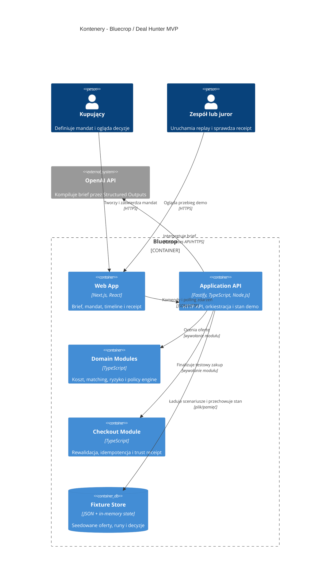

# C4 Level 2: Kontenery

Architektura hackathonowa jest jednym procesem Node.js z modułami domenowymi. Stan istnieje w
pamięci, a sprzedawcy są odtwarzalnymi fixture'ami JSON.

## Granice odpowiedzialności

- Mandate Compiler: brief → walidowany draft mandatu przez fixture albo OpenAI.
- Replay: seedowane oferty i kontrolowane mutacje na potrzeby demo.
- Domain: pełny koszt, exact variant, risk flags i decyzja.
- Checkout: rewalidacja wersji, ceny, limitu, stocku i zgody.
- Audit: timeline zdarzeń oraz trust receipt przechowywane w pamięci procesu.

## Świadome uproszczenia

Nie ma osobnego workera, bazy danych, SSE ani prawdziwego checkoutu. Te elementy nie są potrzebne,
żeby udowodnić główny niezmiennik: model interpretuje, a deterministyczny kod autoryzuje.
