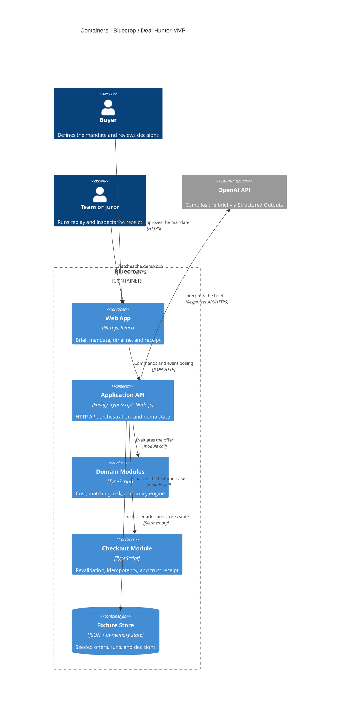

# C4 Level 2: Containers

The hackathon architecture is a single Node.js process with domain modules. State lives in memory,
and merchants are reproducible JSON fixtures.

## Responsibility boundaries

- Mandate Compiler: brief → validated mandate draft via fixture or OpenAI.
- Replay: seeded offers and controlled mutations for the demo.
- Domain: full cost, exact variant, risk flags, and decision.
- Checkout: revalidation of version, price, cap, stock, and consent.
- Audit: event timeline and trust receipt stored in the process memory.

## Deliberate simplifications

There is no separate worker, database, SSE, or real checkout. These elements are not needed to prove
the main invariant: the model interprets, and deterministic code authorizes.
