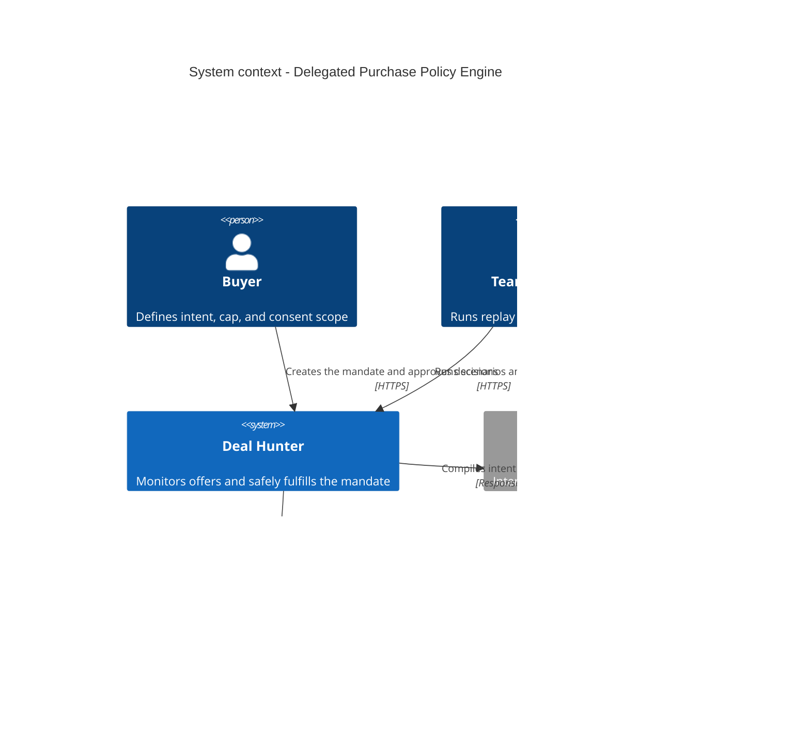

# C4 Level 1: System context

The diagram shows the user, the Deal Hunter system, and the external dependencies. Mocked merchants
are black boxes; we do not model their internals.

## Legend

- Central system: the scope controlled by the team.
- External systems: APIs or mocked adapters outside the core.
- The arrow points to the operation's initiator and describes the intent being transmitted.
