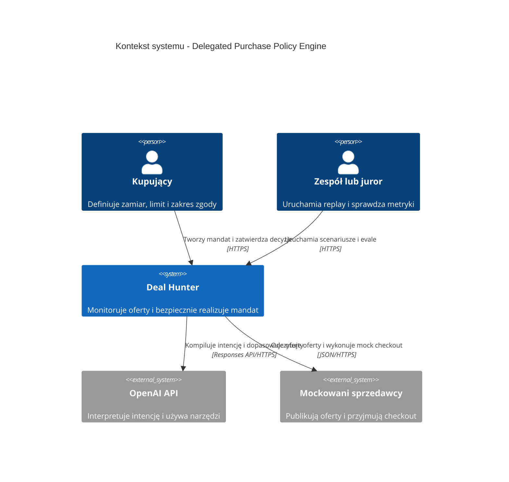

# C4 Level 1: Kontekst systemu

Diagram pokazuje użytkownika, system Deal Hunter oraz zewnętrzne zależności. Mockowani sprzedawcy są czarnymi skrzynkami; nie modelujemy ich wnętrza.

## Legenda

- System centralny: zakres kontrolowany przez zespół.
- Systemy zewnętrzne: API lub mockowane adaptery poza rdzeniem.
- Strzałka wskazuje inicjatora operacji i opisuje przesyłaną intencję.
